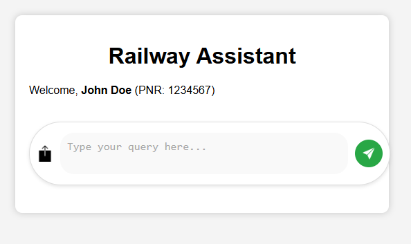

# Railway Assistance Chatbot for Indian Railways

An AI-powered chatbot built to assist passengers of Indian Railways. Users can enter their name and PNR, chat with the AI-based system, and have their queries answered. The chatbot also sends issues to the respective departments responsible for resolving them in the fastest way possible.

## Table of Contents

- [Introduction](#introduction)
- [Prerequisites](#prerequisites)
- [Technologies Used](#technologies-used)
- [Usage](#usage)
- [Screenshots](#screenshots)
- [License](#license)

## Introduction

The Railway Assistance Chatbot is designed to help passengers by answering their queries about Indian Railways, such as train schedules, status, or issues related to their journey. The chatbot uses Google’s Gemini AI to provide quick responses, and if needed, it escalates any issues to the respective department for resolution. Users can enter their name and PNR number, and interact with the chatbot to resolve their queries effectively.

## Prerequisites

Before running the chatbot, ensure that the following prerequisites are met:

1. **Python Environment**  
   Ensure Python is installed on your system.

2. **Google Gemini API Key**  
   - Obtain a Google Gemini API key from [Google Cloud](https://cloud.google.com/ai).  
   - You’ll need to replace the placeholder in `app.py` with your obtained API key.

## Technologies Used

- **Backend**: Python (Flask, flask-cors, google-generativeai, Pillow)  
- **Frontend**: HTML, CSS, JavaScript  
- **AI**: Google Gemini for generative AI-based responses

## Usage

1. Ensure all the prerequisites are met (Python, Google Gemini API Key).  
2. Replace your obtained **Google API key** in `app.py` (in the designated field).  
3. Install all required dependencies listed in `requirements.txt` using pip.  
4. Run the Flask application by executing **`app.py`** and visit the Flask local host in your browser.

## Screenshots

| **Home Page** | **Chatbot Interface** | **Chatbot Response** |
|---------------|-----------------------|----------------------|
|  |  |  |
| *Where user enters their name and PNR number of their train* | *The landing page of the chatbot* | *Example response for a dirty train issue, with an uploaded relevant image* |

## License

This project is open-source and free to use.

